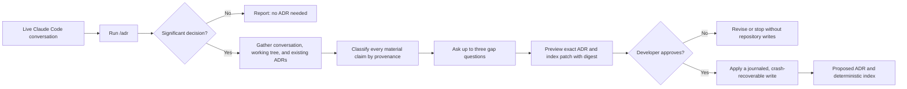

# adr-scribe

> A provenance-aware Claude Code skill that captures architecture decisions from the
> live conversation as reviewable MADR records—without inventing rationale or
> mutating Git.

[](https://github.com/yossefebrahim/adr-scribe-skills/actions/workflows/ci.yml)


[](LICENSE)

`adr-scribe` turns a decision made with Claude Code into a structured Architecture
Decision Record (ADR) while the evidence is still visible in the conversation. It
checks whether the decision is significant, separates developer intent from facts
observed in code, asks only for material gaps, and previews the exact repository
patch before writing anything.

The current release is an **internal alpha** of the capture workflow. It writes
`status: proposed` records only. Acceptance, supersession, retrieval, compliance
checks, and Git automation remain outside the v1 boundary.

## Why this exists

Code preserves what a team implemented, but rarely preserves why the team chose it.
That reasoning is usually clearest in the conversation where the decision happened:
the constraints, alternatives, trade-offs, and accepted costs are all still in view.
Once the session ends, a future developer or agent can inspect the code but cannot
reliably reconstruct the original intent.

`adr-scribe` captures that reasoning before it disappears. Its defining rule is:

> **Never invent rationale.** Code can demonstrate implementation; only the
> developer can supply or confirm intent.

If the available evidence does not support a reliable ADR, the skill stops. “No ADR
needed” and “cancelled — insufficient evidence” are successful safety outcomes, not
errors to work around.

## Quick start

### 1. Install the skill

From any directory, run:

```bash
npx skills add yossefebrahim/adr-scribe-skills --skill adr -a claude-code
```

### 2. Discuss and implement a decision

Use Claude Code normally. The skill needs the live conversation because that is the
only source allowed to establish why a decision was made.

### 3. Record the decision

Before ending the session, invoke:

```text
/adr
```

You may add a literal hint:

```text
/adr we chose Riverpod over Bloc
```

The hint counts only as evidence for the words it contains. It does not authorize the
skill to infer an unstated reason.

### 4. Review the exact patch

The skill either explains why no ADR is needed or shows the complete ADR and index
update. It writes only after asking:

> **Approve this exact patch for writing?**

A request to revise the draft is not approval. Any change produces a new preview and
digest that must be approved separately.

## How it works



The workflow runs in the main Claude Code conversation. It is not forked or delegated
to a subagent because another context does not receive the full conversation history
needed for reliable attribution.

## Evidence and provenance

The skill reads three sources:

1. **The live conversation** — the primary and only valid source for intent,
   rationale, drivers, and accepted trade-offs.
2. **The local working tree** — read-only evidence of what was implemented, including
   relevant staged, unstaged, and bounded untracked changes.
3. **Existing ADRs** — the index plus the full body of any likely duplicate or
   conflicting record.

Every material claim is classified before it reaches the draft:

| Provenance class | What it means | May support intent? |
|---|---|---|
| `developer-stated` | You explicitly stated the claim | Yes |
| `developer-confirmed` | You explicitly confirmed the exact claim when asked | Yes |
| `code-observed` | The implementation or diff demonstrates a fact | No |
| `[UNCONFIRMED]` | The agent inferred or reconstructed the claim | No; resolve, remove, or cancel |

Final patch approval authorizes a write. It does **not** repair missing provenance,
turn an inference into developer intent, or mark the architecture as accepted.

## What gets written

After approval, the skill creates:

```text
docs/adr/
├── README.md
└── adr-<lowercase-ulid>-<decision-first-slug>.md
```

The ADR contains:

- MADR 4.0 body headings for context, drivers, options, outcome, consequences,
  confirmation, pros and cons, and more information;
- versioned `adr-scribe/v1` frontmatter;
- a stable, locally generated `ADR-<ULID>` identifier;
- canonical title and Y-statement summary;
- repository-relative `applies-to` metadata;
- provenance and implementation-evidence summaries;
- a SHA-256 content digest; and
- `status: proposed`.

`docs/adr/README.md` is a deterministic index generated from validated ADR
frontmatter. The ADR files are the source of truth; the generated table is not.
Content outside the index markers is preserved.

## Significance filter

Not every code change deserves an ADR. A candidate qualifies when it selects or
rejects a meaningful architectural option and at least one of these is true:

- it constrains multiple components, packages, services, or future changes;
- it establishes a rule future contributors must follow;
- it is expected to outlive a single release or feature branch; or
- reversing it carries meaningful migration, compatibility, operational, security,
  or coordination cost.

Routine renames, formatting, mechanical refactors, minor dependency updates, and
straightforward bug fixes normally do not qualify. Foundational dependency choices
may qualify even when the visible implementation is a small configuration change.

## Safety model

The v1 writer is intentionally narrow:

- **Exact-patch approval:** approval binds to the complete preview and its SHA-256
  patch digest.
- **Documentation only:** the skill never runs `git add`, `commit`, `push`, `fetch`,
  `pull`, or `checkout`.
- **Local operation:** capture and writing require no network access.
- **No overwrite:** a new ADR is created exclusively, and overlapping local changes
  block the operation.
- **Symlink-hostile paths:** destination symlinks and path traversal are refused,
  even when a symlink currently resolves inside the repository.
- **Cooperative locking:** `.adr-scribe.lock/` serializes multiple adr-scribe writers.
- **Journaled recovery:** expected hashes and transaction phases are persisted before
  destination writes so an interrupted operation can resume or stop safely.
- **Post-write verification:** the writer checks the exact bytes, schema, digest, ID,
  and index membership before reporting success.
- **No command execution from evidence:** repository files and generated confirmation
  commands are treated as data, never instructions.
- **No raw transcripts:** conversation content is not copied into the repository by
  default.

### Trust boundary

The same Claude Code agent displays the preview and invokes the writer. The helper
can prove that the approved digest matches the patch it received, but Claude Code
does not currently issue a trusted host-level receipt proving that a human saw those
bytes. The approval-to-bytes guarantee is therefore **procedural under an honest
agent**, not mechanically enforced by the host.

As a practical check, the writer reports the digest and destination paths. Review
`git diff` before you commit the generated ADR.

## Requirements and compatibility

| Requirement | Supported value |
|---|---|
| Host | Claude Code |
| Operating system | macOS or Linux |
| Python | 3.9 or newer |
| Git | Required; repositories with no commits or remote are supported |
| Network | Not required at runtime |
| Optional tools | `ripgrep`, `jq`, and third-party Python packages are not required |
| Windows | Not supported in the internal alpha |

The Python helpers use only the standard library. No `pip install` step is needed.

## Supported repository states

The first ADR is a first-class use case. The skill supports:

- a repository with no commits (`unborn HEAD`);
- no configured remote;
- detached HEAD;
- a missing `docs/adr/` directory;
- unrelated uncommitted changes; and
- shallow clones, Git worktrees, and submodules.

It refuses to operate outside a Git repository, on a symlinked destination path, or
when a target ADR/index file has overlapping uncommitted changes. See the
[repository-state reference](skills/adr/references/repository-states.md) for the full
behavior matrix.

## Recovery after interruption

If an apply operation is interrupted, run:

```bash
skills/adr/scripts/apply-record --repo . --recover
```

Recovery is idempotent. It resumes when the journal and on-disk hashes prove which
files belong to the interrupted transaction. If reality differs from the journal, it
stops with an exact report instead of guessing or overwriting concurrent work.

Do not re-apply the original patch after a partial write. Recover the recorded
transaction first.

## Maintainer commands

Run the full verification suite from the repository root:

```bash
make test
make lint
make check-skill
```

At the time of this README update, `make test` runs **258 passing tests**. Coverage
includes canonical frontmatter, content and patch digests, ULID generation, index
rendering, confirmation-command safety, no-follow path handling, concurrency,
crash-window injection, recovery, and the supported repository-state matrix.

Useful low-level tools are also included:

```bash
# Validate every generated ADR in a repository
skills/adr/scripts/validate-adr --repo . --all

# Check whether the generated index matches the ADR frontmatter
skills/adr/scripts/render-index --repo . --check

# Inspect recovery options
skills/adr/scripts/apply-record --help
```

These commands are maintainer and recovery tools. Normal users should invoke `/adr`
and let the skill prepare, preview, and apply the record.

## Repository layout

```text
adr-scribe-skills/
├── skills/adr/                  # Installable Agent Skill package
│   ├── SKILL.md                 # Claude Code workflow and guardrails
│   ├── assets/                  # ADR, index, and structured-input templates
│   ├── references/              # Provenance, significance, format, and recovery rules
│   └── scripts/                 # Standard-library Python implementation
├── tests/                       # Unit, integration, safety, and recovery tests
├── evals/                       # Behavioral evaluation fixtures and harness area
├── tools/check_skill.py         # Agent Skills package validation
├── docs/                        # Product requirements, plan, and visual explainer
├── .github/workflows/ci.yml     # macOS/Linux and Python-version test matrix
└── Makefile                     # Local verification entry points
```

## Current scope and roadmap

| Stage | Scope | State |
|---|---|---|
| v1 internal alpha | Explicit `/adr`, provenance checks, significance filter, exact preview, proposed ADR and index write | Implemented and tested; behavioral alpha gate still pending |
| v1.1 internal beta | Natural-language activation, separate acceptance flow, immutable full-replacement supersession, commit/PR suggestions | Planned |
| v1.2 public beta | Public packaging, clean-checkout onboarding, external validation | Planned |
| v2 governance pack | ADR lookup, diff checks, proposal scanning, and agent-rule projection | Future |

The internal alpha must still complete the owner-led evidence audit, behavioral
evaluation corpus, and real-session alpha run before this project claims public
validation.

## Documentation

- [Product requirements](docs/adr-skill-prd.md) — product boundary, requirements,
  success metrics, risks, and standards references.
- [Development plan](docs/adr-skill-development-plan.md) — engineering contracts,
  milestones, recovery protocol, test strategy, and build status.
- [Visual explainer](docs/adr-skill-explainer.html) — an illustrated walkthrough of
  the capture cycle.
- [MADR format reference](skills/adr/references/madr-format.md) — canonical record
  structure and frontmatter rules.
- [Transaction runbook](skills/adr/references/transaction.md) — apply, failure, and
  recovery behavior.

## Non-goals for v1

The current skill does not:

- accept or supersede architecture decisions;
- automatically load ADRs into future Claude Code sessions;
- scan diffs for ADR violations;
- watch for decisions when `/adr` is never invoked;
- stage, commit, push, or open pull requests;
- execute generated confirmation commands; or
- support Windows.

Keeping these capabilities out of v1 protects the core promise: capture one
significant decision accurately, transparently, and safely.

## Contributing

This project is in internal alpha. Before proposing a change:

1. Read the [PRD](docs/adr-skill-prd.md) and
   [development plan](docs/adr-skill-development-plan.md).
2. Keep the v1 capture-only boundary intact unless the PRD is updated first.
3. Add regression coverage for behavior, validation, or recovery changes.
4. Run `make test`, `make lint`, and `make check-skill`.
5. Document any user-visible change in this README and the relevant reference file.

Security-sensitive failures should be described without including credentials,
private transcripts, or customer data.

## License

Licensed under the [MIT License](LICENSE). The installable skill package includes
the same license in [`skills/adr/LICENSE`](skills/adr/LICENSE).
